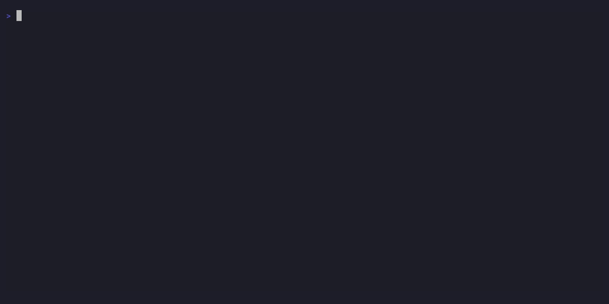

# aegis

[](https://github.com/qwexvf/aegis-cli/actions/workflows/ci.yml)
[](https://goreportcard.com/report/github.com/qwexvf/aegis-cli)
[](LICENSE)

Supply-chain security scanner for 9 package ecosystems and GitHub Actions workflows. No account, no API key, no backend.



- **CVE / GHSA lookup** — batch query against [OSV.dev](https://osv.dev), all 9 ecosystems in one shot
- **AST capability scan** — tree-sitter walks every package source; surfaces `shell-spawn`, `net-egress`, `dynamic-eval`, `fs-write-outside-root` and more, even on packages with no advisory yet
- **Behavior heuristics** — postinstall hooks doing `curl|sh`, obfuscated payloads, typosquat names (Levenshtein distance 2), maintainer hijack patterns, patch-version capability drift, git-SHA optional deps (worm propagation vector), unlisted large files (smuggled payloads), yanked-version detection
- **Transitive deps included** — lockfile-based; every resolved package is scanned, not just direct deps
- **Polyglot monorepo** — finds all lockfiles, merges into a single `aegis.lock`
- **CycloneDX 1.5 SBOM** — `aegis sbom` emits a standards-compliant BOM from the snapshot; `--include-vulns` attaches OSV advisories
- **GitHub Actions scanner** — `aegis actions scan` walks `.github/workflows/*.yml` (or fetches from a remote repo with `--repo owner/repo`); flags unpinned action refs, `pull_request_target` + checkout escalation, OIDC + npm publish worm vector, `actions/cache` poisoning, script injection, `curl|sh` in `run:` blocks, and `permissions: write-all`; outputs SARIF 2.1.0 with `--sarif` for GitHub Code Scanning
- **Offline capable** — `AEGIS_NO_VULN_LOOKUP=1` for air-gapped use; self-hosted OSV mirror via `AEGIS_OSV_URL`

## Ecosystems

| Ecosystem     | Lockfiles                                                             | OSV | AST scan      |
|---------------|-----------------------------------------------------------------------|-----|---------------|
| **npm**       | `package-lock.json`, `pnpm-lock.yaml`, `yarn.lock`, `bun.lock`       | ✅  | ✅ `jsscan`   |
| **PyPI**      | `poetry.lock`, `uv.lock`, `Pipfile.lock`, `requirements.txt`         | ✅  | ✅ `pyscan`   |
| **RubyGems**  | `Gemfile.lock`                                                        | ✅  | ✅ `rbscan`   |
| **crates.io** | `Cargo.lock`                                                          | ✅  | ✅ `rsscan`   |
| **Go**        | `go.sum` / `go.mod`                                                   | ✅  | ✅ `goscan`   |
| **Maven**     | `pom.xml`, `gradle.lockfile`                                          | ✅  | ✅ `jvscan`   |
| **Packagist** | `composer.lock`                                                       | ✅  | ✅ `phpscan`  |
| **NuGet**     | `packages.lock.json`                                                  | ✅  | ✅ `csscan`   |
| **Gleam**     | `manifest.toml`                                                       | ✅  | ✅ `gleamscan`|

## Install

```sh
go install github.com/qwexvf/aegis-cli/cmd/aegis@latest
```

Pre-built binaries (cosign-signed, SLSA provenance): [Releases](https://github.com/qwexvf/aegis-cli/releases)

```sh
# verify before running
cosign verify-blob \
  --certificate-identity-regexp 'https://github.com/qwexvf/aegis-cli/.github/workflows/release.yml.*' \
  --certificate-oidc-issuer 'https://token.actions.githubusercontent.com' \
  --certificate checksums.txt.pem \
  --signature   checksums.txt.sig \
  checksums.txt
sha256sum -c checksums.txt
```

## Usage

```sh
# snapshot the lockfile and scan
aegis snapshot save                  # parse lockfile → aegis.lock
aegis snapshot enrich                # AST scan + CVE lookup
aegis snapshot show                  # direct deps
aegis snapshot show --all            # + transitive
aegis snapshot diff baseline.lock    # drift between two snapshots

# CI gate — exits 1 on findings ≥ threshold
aegis ci --fail-on=block
aegis ci --fail-on=prompt --json     # machine-readable output

# analyze a package ad hoc (fetches from registry)
aegis analyze lodash@4.17.21
aegis analyze --evidence ua-parser-js@0.7.29

# analyze a local source tree (no registry fetch)
aegis analyze rubygems/rest-client@1.6.13 \
    --local examples/incidents/rubygems/rest-client-1.6.13/

# SBOM export (CycloneDX 1.5 JSON)
aegis sbom > sbom.json
aegis sbom --pretty --include-vulns -o sbom.json
aegis sbom --project=my-service -o sbom.json

# allowlist
aegis allowlist add lodash \
    --capability=dynamic-eval \
    --version='^4' \
    --reason='_.template uses Function() to compile templates'
aegis allowlist list
aegis allowlist test npm/lodash@4.17.21
aegis allowlist verify

# GitHub Actions workflow scanner
aegis actions scan                   # scan .github/workflows/ in cwd
aegis actions scan --fail-on=high    # exit 1 on high/critical findings
aegis actions scan --json            # machine-readable output

# shell completion
aegis completion bash > /etc/bash_completion.d/aegis
aegis completion zsh  > "${fpath[1]}/_aegis"
aegis completion fish > ~/.config/fish/completions/aegis.fish
```

## How it works

1. **Parse** — lockfile → every resolved `(name, version)`, direct and transitive
2. **Fetch** — tarballs from the registry; cached under `~/.aegis/cache/sources/`
3. **AST scan** — tree-sitter walks each file; emits `capability:file:line:snippet` evidence
4. **Heuristics** — behavior-based detectors over the tarball and registry metadata (no network beyond step 2):
   - install hooks doing `curl|sh`, `bun run <file> && exit 1`, and similar download-execute patterns
   - `optionalDependencies` pointing at git SHA commits (worm-propagation injection vector)
   - VCS dependencies (`git+https://`, `git = "..."`, `:git =>`) across PyPI, Cargo, RubyGems, Go, Composer, Gleam — bypasses registry immutability
   - unlisted large code files (≥512 KB not in `files` field — smuggled payload shape)
   - confirmed-malware IOC filenames (`router_init.js`, `router_runtime.js`, `tanstack_runner.js`)
   - yanked versions: lockfile pinning a version removed from the registry flags users who installed during an incident window
   - maintainer hijack: publisher change between consecutive releases, fresh publish on abandoned package
   - tarball drift: files in the published tarball absent from the upstream git tag (requires GitHub access)
   - typosquat: name within Levenshtein distance 2 of a top-1000 package
5. **CVE lookup** — batch POST to OSV.dev; severity cached under `~/.aegis/cache/advisories/`
6. **Allowlist** — builtin → `~/.aegis/allowlist.yaml` → `.aegis-allowlist.yaml`; specific beats wildcard
7. **Verdict** — `max(ast, advisory)` vs `--fail-on`; Critical/High → `block`, Medium → `prompt`, Low → `review`

## Allowlist

```yaml
# .aegis-allowlist.yaml — commit this for team-shared suppressions
version: 1
rules:
  - ecosystem: npm
    name: lodash
    version: "^4"
    capability: dynamic-eval
    reason: "_.template uses Function() to compile templates"
```

Three layers, in match order: builtin (~20 curated rules) → user (`~/.aegis/allowlist.yaml`) → project (`.aegis-allowlist.yaml`).

## GitHub Actions Workflow Scanner

```bash
# Scan local workflows
aegis actions scan

# Scan a remote repository (uses $GITHUB_TOKEN)
aegis actions scan --repo owner/repo

# Emit SARIF for GitHub Code Scanning
aegis actions scan --sarif > results.sarif
```

Suppress known-safe findings with `.aegis-actions-allowlist.yaml`:

```yaml
version: 1
rules:
  - kind: unpinned_ref
    file: .github/workflows/release.yml
    reason: "pinned via dependabot"
  - kind: write_all_permissions
    reason: "covered by network policy"
```

Upload to GitHub Security tab:

```yaml
- run: aegis actions scan --sarif > aegis.sarif
- uses: github/codeql-action/upload-sarif@v3
  with:
    sarif_file: aegis.sarif
```

## CI

Drop-in templates in [`examples/ci/`](examples/ci/) for GitHub Actions, GitLab CI, and generic shell.

| Exit code | Meaning |
|-----------|---------|
| `0`       | clean — no findings ≥ `--fail-on` |
| `1`       | findings ≥ `--fail-on` |
| `2`       | verdict failed (config / network error) |

**One-step full audit (packages + GitHub Actions workflows):**

```yaml
- name: aegis full audit
  run: aegis ci --scan-actions --sarif > aegis.sarif

- name: Upload SARIF to GitHub Security
  uses: github/codeql-action/upload-sarif@v3
  with:
    sarif_file: aegis.sarif
  if: always()
```

| Flag | Description |
|---|---|
| `--scan-actions` | Also scan `.github/workflows/` (same checks as `aegis actions scan`) |
| `--sarif` | Emit SARIF 2.1.0 for GitHub Code Scanning |
| `--fail-on` | Threshold: `safe\|review\|prompt\|block` (default: `block`) |
| `--baseline` | Drift mode — only fail on newly-introduced findings |

`aegis ci --json` output is stable for tooling — see [`examples/ci/README.md`](examples/ci/README.md).

## Docs

Full docs: **[qwexvf.github.io/aegis-cli](https://qwexvf.github.io/aegis-cli/)**

- [Getting started](https://qwexvf.github.io/aegis-cli/getting-started/)
- [Command reference](https://qwexvf.github.io/aegis-cli/reference/commands/)
- [Cookbook](https://qwexvf.github.io/aegis-cli/guides/cookbook/)
- [Architecture](https://qwexvf.github.io/aegis-cli/contributing/architecture/)
- [CHANGELOG.md](CHANGELOG.md)

## Contributing

See [CONTRIBUTING.md](CONTRIBUTING.md). Open an issue before a non-trivial PR.
Vulnerability reports: [GitHub Private Vulnerability Reporting](https://github.com/qwexvf/aegis-cli/security/advisories/new) — not public issues.
Maintainers cutting a release: [RELEASING.md](RELEASING.md).

## License

[Apache-2.0](LICENSE)
